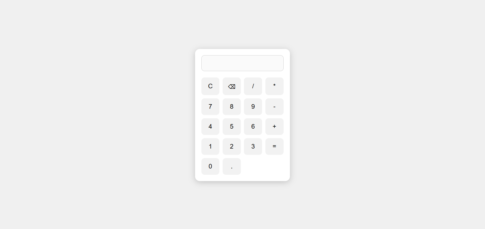

# Calculator App

A responsive calculator web app built with **HTML**, **CSS**, and **JavaScript**. Supports basic arithmetic operations with a clean and user-friendly interface.

## Live Demo

👉 [View Calculator App](https://snehamp12.github.io/calculator-app/)

## Preview

## Features

- Basic arithmetic operations: Add, Subtract, Multiply, Divide
- Responsive layout (mobile + desktop)
- Clean and minimal UI
- JavaScript DOM manipulation

## Built With

- HTML
- CSS
- JavaScript

## Author

- [Sneha MP](https://github.com/snehamp12)

